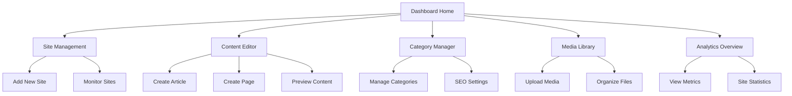

# WordPress Dashboard Management System - Product Requirements Document

## 1. Product Overview
A comprehensive web-based dashboard that enables users to manage multiple WordPress sites from a single interface, providing streamlined content creation and management capabilities.

The system solves the complexity of managing multiple WordPress installations by centralizing article, page, and category management through an intuitive dashboard interface. Target users include content managers, bloggers, and agencies managing multiple WordPress sites who need efficient content workflow management.

This product aims to reduce content management time by 60% and provide a unified experience across multiple WordPress installations.

## 2. Core Features

### 2.1 User Roles
| Role | Registration Method | Core Permissions |
|------|---------------------|------------------|
| Site Manager | Email registration + site verification | Full access to assigned WordPress sites, content CRUD operations |
| Content Editor | Invitation by Site Manager | Create and edit content, manage categories, limited site settings |
| Viewer | Invitation code | Read-only access to content and analytics |

### 2.2 Feature Module
Our WordPress dashboard consists of the following main pages:
1. **Dashboard Home**: site overview cards, recent activity feed, quick actions panel
2. **Site Management**: WordPress site connection, site health monitoring, bulk operations
3. **Content Editor**: article/page creation, rich text editor, media integration, preview functionality
4. **Category Manager**: category hierarchy management, bulk category operations, SEO settings
5. **Media Library**: file upload interface, media organization, image optimization tools
6. **Analytics Overview**: content performance metrics, site statistics, engagement data

### 2.3 Page Details
| Page Name | Module Name | Feature description |
|-----------|-------------|---------------------|
| Dashboard Home | Site Overview Cards | Display connected WordPress sites with health status, recent posts count, and quick access buttons |
| Dashboard Home | Activity Feed | Show recent content changes, published articles, and system notifications in chronological order |
| Dashboard Home | Quick Actions | Provide shortcuts for creating new posts, pages, and accessing frequently used features |
| Site Management | Site Connection | Add new WordPress sites via REST API credentials, test connections, manage authentication |
| Site Management | Health Monitoring | Monitor site uptime, plugin updates, WordPress version status, and security alerts |
| Site Management | Bulk Operations | Perform batch operations across multiple sites like plugin updates and content synchronization |
| Content Editor | Article Creation | Create and edit WordPress posts with rich text editor, custom fields, and metadata management |
| Content Editor | Page Management | Design and manage WordPress pages with template selection and custom layouts |
| Content Editor | Media Integration | Upload and insert images, videos, and documents directly into content with optimization |
| Content Editor | Preview System | Real-time preview of content as it will appear on the WordPress site before publishing |
| Category Manager | Hierarchy Management | Create, edit, and organize categories in tree structure with drag-and-drop functionality |
| Category Manager | SEO Settings | Configure category descriptions, meta tags, and URL slugs for search optimization |
| Category Manager | Bulk Operations | Mass assign categories to posts, merge categories, and perform cleanup operations |
| Media Library | File Upload | Drag-and-drop file upload with progress tracking and automatic format conversion |
| Media Library | Organization | Organize media files in folders, add tags and descriptions, search and filter capabilities |
| Media Library | Optimization | Automatic image compression, format conversion, and CDN integration for performance |
| Analytics Overview | Performance Metrics | Display post views, engagement rates, and content performance across all connected sites |
| Analytics Overview | Site Statistics | Show traffic data, user behavior, and content popularity trends with visual charts |

## 3. Core Process

**Site Manager Flow:**
1. Register account and verify email
2. Connect WordPress sites by entering REST API credentials
3. Navigate to Content Editor to create articles or pages
4. Use Category Manager to organize content structure
5. Upload media files through Media Library
6. Monitor site performance via Analytics Overview
7. Manage team access through user invitation system

**Content Editor Flow:**
1. Access dashboard through invitation link
2. Select target WordPress site from connected sites
3. Create new content using rich text editor
4. Assign categories and upload media as needed
5. Preview content before publishing
6. Publish directly to WordPress site or save as draft

## 4. User Interface Design

### 4.1 Design Style
- **Primary Colors**: Deep blue (#1e40af) for headers and primary actions, light blue (#3b82f6) for secondary elements
- **Secondary Colors**: Gray scale (#f8fafc to #1f2937) for backgrounds and text, green (#10b981) for success states
- **Button Style**: Rounded corners (8px radius) with subtle shadows, hover animations with color transitions
- **Font**: Inter font family, 14px base size for body text, 16px for buttons, 24px+ for headings
- **Layout Style**: Card-based design with clean spacing, left sidebar navigation, responsive grid system
- **Icons**: Heroicons style with consistent 20px size, WordPress brand colors for site-specific elements

### 4.2 Page Design Overview
| Page Name | Module Name | UI Elements |
|-----------|-------------|-------------|
| Dashboard Home | Site Overview Cards | Grid layout with 3-column cards, each showing site favicon, name, status indicator (green/yellow/red), and action buttons |
| Dashboard Home | Activity Feed | Vertical timeline with timestamps, user avatars, action descriptions, and expandable details |
| Site Management | Connection Form | Clean form with input validation, connection test button, and step-by-step setup wizard |
| Content Editor | Rich Text Editor | Full-width editor with floating toolbar, distraction-free mode, and live word count |
| Content Editor | Preview Panel | Split-screen layout with editor on left, live preview on right, responsive breakpoint toggles |
| Category Manager | Tree View | Hierarchical list with expand/collapse icons, drag handles, and inline editing capabilities |
| Media Library | Grid Gallery | Masonry layout for images, list view for documents, upload dropzone with progress bars |
| Analytics Overview | Dashboard Charts | Card-based metrics with Chart.js visualizations, date range selectors, and export options |

### 4.3 Responsiveness
Desktop-first design with mobile-adaptive breakpoints at 768px and 1024px. Touch-optimized interactions for mobile devices including swipe gestures for navigation and enlarged touch targets for buttons. Sidebar collapses to hamburger menu on mobile with slide-out navigation panel.